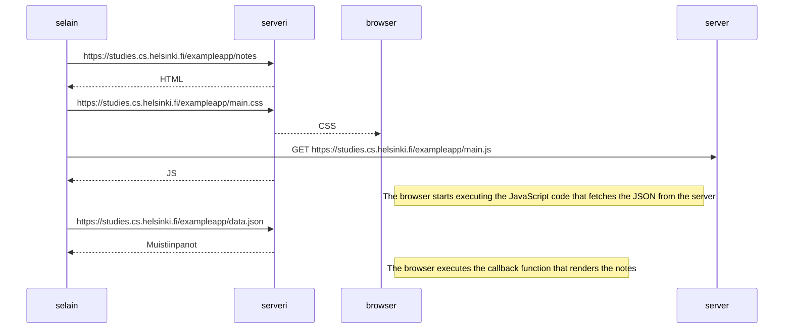

```mermaid
sequenceDiagram
    participant selain
    participant serveri
    
    selain->>serveri: https://studies.cs.helsinki.fi/exampleapp/notes
    serveri-->>selain: HTML
    
    selain->>serveri: https://studies.cs.helsinki.fi/exampleapp/main.css
    serveri-->>browser: CSS
    
    selain->>server: GET https://studies.cs.helsinki.fi/exampleapp/main.js
    serveri-->>selain: JS
    
    Note right of browser: The browser starts executing the JavaScript code that fetches the JSON from the server
    
    selain->>serveri: https://studies.cs.helsinki.fi/exampleapp/data.json
    serveri-->>selain: Muistiinpanot

    Note right of browser: The browser executes the callback function that renders the notes

```
